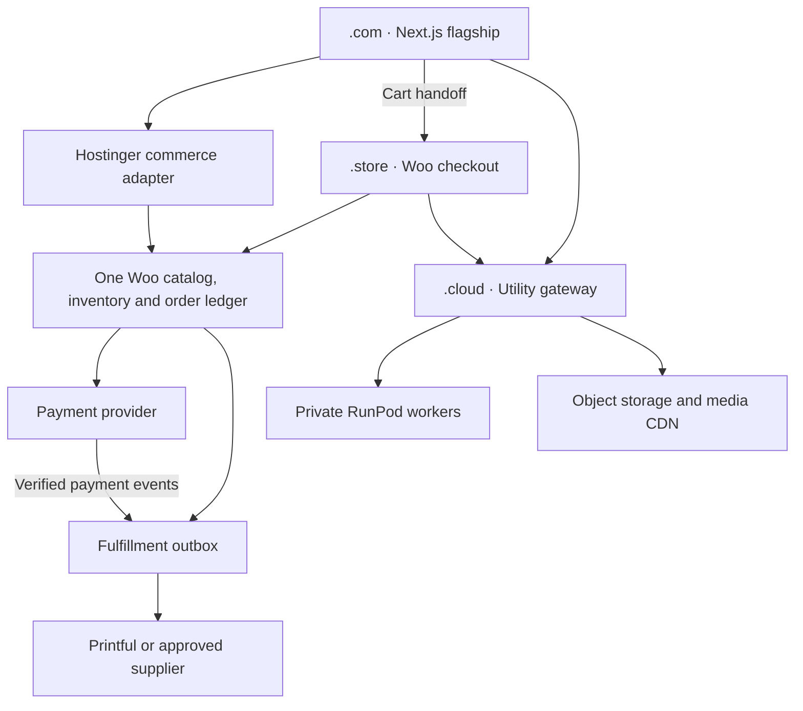

# Hustler Dior — commerce and growth execution blueprint

Prepared September 13, 2026. Creative direction: Swerve God. The architecture below is a proposed rollout with explicit acceptance gates, not a claim that payments, GPU services, marketing automations or search rankings have already been validated in production.

**Decision:** keep the Next.js flagship and use **one WooCommerce installation as the commerce authority** if FunnelKit, native Woo checkout and Omnisend integration are the chosen direction. Host both applications on Hostinger. Put AI behind a stable application gateway; use RunPod only for inference. Do not operate two independently writable stores.

**Verified current state:** a Next.js preview is deployed at https://lightgoldenrodyellow-snake-788114.hostingersite.com with live Printful catalog data. Color/size selection and adding the selected variant to the bag passed browser checks. Checkout and paid photo generation are disabled. The connected Hostinger account lists hustlerdior.com, hustlerdior.cloud and **hustlerdior.shop**. It does not list hustlerdior.store; that domain might be elsewhere, but control must be verified before routing it. The current .com Builder project and .cloud/.shop Horizons projects have not been replaced. In examples below, `CHECKOUT_ORIGIN` means the verified conversion domain; use .shop if .store is not available and chosen.

## 1. Commerce ownership and deployment topology



| Responsibility | Owner | Implementation consequence |
| --- | --- | --- |
| Retail prices, promotions, publish state | WooCommerce | Printful retail prices cannot overwrite approved prices on every sync. |
| Supplier availability and cost | Printful / authorized supplier feed | Normalize by variant and destination; unavailable or unknown is not a promise of stock. |
| Cart totals, taxes, delivery and reservations | WooCommerce | Recalculate on handoff, address changes and payment; ignore browser prices. |
| Checkout and smart offers | Woo + FunnelKit on conversion domain | The PHP cart/checkout plugins do not automatically execute inside a Next.js page. |
| Flagship pages, schema and content | Next.js / approved content records | One canonical product representation, backed by Woo data. |
| Shipping order | One fulfillment outbox | Exactly one dispatch owner per supplier; use idempotency and reconciliation. |
| Media and photo jobs | Utility gateway | A GPU outage must leave catalog browsing and payment usable. |

**Why not Multisite by default?** Multisite shares WordPress installation files and can share themes/plugins; each site has separate database tables. It is not a shared Woo inventory or cross-domain cart feature. If editorial staff need two WordPress sites, create a network with Woo active on the commerce site only, and make the editorial site a client of that same commerce API. Network activation of Woo on two sites does not solve synchronization. [WordPress network architecture](https://developer.wordpress.org/advanced-administration/multisite/create-network/)

### Hostinger implementation sequence

1. **Preserve the current sites.** Export the existing .com Builder content/assets and DNS zone; retain the working Next.js source and deployment. Create a separate WordPress staging website within the existing plan's limits. Do not delete the Builder project to free its domain. Test the replacement before changing the domain attachment.
2. **Install one Woo site.** Use Hostinger's WordPress installer on the verified checkout domain/staging domain. Choose supported PHP, HTTPS and pretty permalinks; select USD and the initial delivery market. Configure tax and delivery policies from the actual business setup. Enable HPOS only after every selected extension passes compatibility checks. Configure a real scheduler for due jobs; do not depend on storefront traffic to run fulfillment.
3. **Choose one funnel engine.** Recommended: FunnelKit Cart plus FunnelKit checkout/upsells, in a licensed tier that includes the required features. CartFlows is an alternative checkout/upsell owner, not an additional checkout layer. Keep a version matrix for Woo, theme, gateway, funnel engine and Printful adapter.
4. **Build a reversible catalog import.** Start with ten representative parent products: tee, hoodie, crop, bottom and accessory, including large sizes and multiple colors. Import as drafts. Preserve stable SKUs and store `_hd_printful_sync_variant_id`, supplier ID, catalog variant ID, cost timestamp and approved image source. Validate all 2,444 existing Printful variants before full migration; do not create a second Printful product for each import.
5. **Connect the Next.js server adapter.** Woo → Settings → Advanced → REST API → Add key. Use a dedicated service user with minimum required capabilities and a read-only key for public catalog projection. Keep administrative write access separate. Fetch `/wp-json/wc/v3/products?status=publish&per_page=100&page=1`, then all pages and every variable product's `/products/{id}/variations`. Read `X-WP-TotalPages`; limit concurrency to four. Strip private metadata/costs before returning data to the browser. [Woo REST API and pagination](https://developer.woocommerce.com/docs/apis/rest-api/)
6. **Use the customer Store API for carts.** Obtain `Cart-Token` from `GET /wp-json/wc/store/v1/cart`; keep it behind the .com session in the server adapter. Send it in headers for subsequent cart operations. It is a cart capability, never an administrative API key. Explicitly design and test the transition from a Store API cart to a native Woo cookie session; a token is not automatically a FunnelKit browser session. [Woo cart tokens](https://developer.woocommerce.com/docs/apis/store-api/cart-tokens/)
7. **Set freshness budgets.** Cache public product descriptions/images for 300 seconds and use product/variant cache tags. Product create/update/delete events invalidate the projection. Reconcile modified products every five minutes and the full catalog nightly. Catalog display can use last-known data briefly during an upstream outage, but payment always checks current price, purchasability and delivery. Alert at stock-sync age >5 minutes; pause affected finite-stock drops at >10 minutes.
8. **Persist webhook work before acknowledging.** Woo → Settings → Advanced → Webhooks; configure product and order topics with separate strong secrets. Verify the raw-body HMAC against `X-WC-Webhook-Signature`, write the event and outbox in one transaction, then return 2xx. Deduplicate delivery IDs and business operations; events may be duplicated or out of order. Monitor disabled webhooks and failed delivery logs. [Woo webhook configuration](https://woocommerce.com/document/webhooks/)
9. **Assign one Printful order writer.** Choose a tested official Woo integration OR the custom fulfillment worker after adapting it to Woo orders. Never enable both writers. An `order.created` event is not evidence of payment. Dispatch only after authenticated gateway evidence, order-total reconciliation and completed upsell decisions. Keep the existing draft/review step until tax, refunds and real fulfillment testing pass.
10. **Cut over as a separate release.** Freeze catalog edits, export a final mapping, reconcile counts/prices, disable the old checkout writer, switch the Next catalog adapter, verify ten carts, and then attach the production domain. If orders exist, rollback must preserve the Woo order ledger; do not restore yesterday's database over new orders.

**Field contract to store for each sellable variant:** `sku`, `woo_product_id`, `woo_variation_id`, `supplier`, `supplier_variant_id`, `color`, `size`, `currency`, `retail_minor`, `landed_cost_minor`, `availability`, `availability_checked_at`, `image_rights_reference`, `dispatch_owner`. Store costs privately; publish only approved fields. Wholesale images and descriptions enter staging until supplier access, resale rights, stock and fulfillment arrangements are verified. Branded footwear must retain its actual brand and authentication provenance.

### Cross-domain cart handoff

Cookies and localStorage do not cross .com/.store/.cloud boundaries. Do not set `Domain=.hustlerdior` or expose Woo cart tokens in links.

1. A .com session stores the authoritative cart handle in a durable server-side session store. On bag opening and after each change, mint a 32-byte random handoff ticket. Store only its SHA-256 hash, target host, cart revision, allowed variant IDs/quantities and a 120-second expiry in the commerce service.
2. Render a normal, user-submitted HTML form whose action is `CHECKOUT_ORIGIN + /hd-handoff`. Put the ticket in a hidden POST field. Refresh it while the bag is open before expiry. Enable GA form decoration. The ticket contains no payment authority or customer address.
3. The receiving WordPress plugin validates the exact source Origin, ticket, destination, expiry and cart revision. Atomically claim the ticket. Initialize a fresh Woo session, add the validated products using Woo cart methods, reapply only server-approved offers and calculate totals. Store cookies are `Secure`, `HttpOnly` where applicable and host-scoped.
4. Return a 303 to `/checkout/`, preserving the validated `_gl` linker value through the redirect. Keep `Cache-Control: private, no-store` on both responses. Redact tickets from logs and analytics. Existing destination carts require a visible merge/replace choice rather than silently overwriting shopper selections.
5. A repeat claim returns 409, expired returns 410, bad origin 403. Restore failure creates no order and offers a return to the intact source bag. GET requests and link scanners never redeem the ticket. The custom bridge is a development task, not a stock Woo feature.

Do this with a database transaction/row lock, not an in-memory map or an unguarded WordPress transient. If the transfer fails after claiming, retain a recoverable handoff state bound to the destination session; do not replay a partly applied cart blindly.

### Configuration boundary

```dotenv
# Proposed migration settings; placeholders only. Do not put secrets in NEXT_PUBLIC_*.
FLAGSHIP_ORIGIN=https://hustlerdior.com
CHECKOUT_ORIGIN=https://hustlerdior.store
UTILITY_ORIGIN=https://hustlerdior.cloud
WOO_ORIGIN=https://hustlerdior.store
WOO_CATALOG_KEY=SET_PRIVATELY
WOO_CATALOG_SECRET=SET_PRIVATELY
WOO_WEBHOOK_SECRET=SET_PRIVATELY
UTILITY_SERVICE_TOKEN=SET_PRIVATELY
RUNPOD_API_KEY=SET_PRIVATELY
RUNPOD_ENDPOINT_ID=SET_AFTER_DEPLOYMENT
OMNISEND_API_KEY=SET_PRIVATELY
OMNISEND_API_VERSION=2026-03-15
TRYON_ENABLED=false
CHECKOUT_ENABLED=false
```

Hostinger API tokens belong in deployment tooling only. The current Next.js app still uses its existing Printful adapter and guarded Stripe foundation; these new variables do not implement a Woo migration by themselves.

## 2. DNS, TLS, routing and RunPod

**DNS selects a host, not an API path.** A record cannot send `/api/try-on` to RunPod while leaving `/` on Hostinger. The application/reverse proxy performs that routing. Keep a stable HTTPS gateway under .cloud; it submits jobs to the authenticated RunPod API. RunPod Pods and queue endpoints are not interchangeable hosting targets. [RunPod job API](https://docs.runpod.io/serverless/endpoints/send-requests)

In hPanel: **Domains → DNS → choose domain → DNS records**. Export the zone first. Verify Hostinger is authoritative; if its nameservers are not authoritative, make the records at the actual DNS provider. Preserve existing MX, SPF, DKIM and DMARC records. Use TTL 300 during the change, then 3600 after validation. [Hostinger DNS editor](https://www.hostinger.com/support/1583249-how-to-manage-dns-records-at-hostinger/)

| Zone / name | Type | Destination | TLS and routing owner |
| --- | --- | --- | --- |
| .com / `@` | Hostinger-provided A or ALIAS | Verified Next.js domain attachment target | Hostinger certificate for .com |
| .com / `www` | CNAME | Exact target from Hostinger's domain setup | Certificate for www, then 308 to .com preserving path/query |
| .store / `@`, `www` | Hostinger-provided A/ALIAS and CNAME | Verified Woo website target | Separate .store certificate; only after domain control |
| .cloud / `@` | A/ALIAS supported by its host | Stable utility UI/application, initially Hostinger | Certificate for .cloud; preserve current Horizons project until replacement ready |
| .cloud / `api` | CNAME or A | Stable API gateway's assigned hostname or fixed IP | Gateway terminates TLS for api.hustlerdior.cloud |
| .cloud / `media` | CNAME | Custom-domain target issued by object-storage/CDN provider | CDN issues certificate for media.hustlerdior.cloud |
| .cloud / `b2b` | CNAME or A | Authenticated B2B application | Its host issues the certificate; role checks on every resource |
| .cloud / `*` | Optional CNAME/A | Gateway target only when tenant subdomains are actually needed | Explicit wildcard certificate and host allowlist required |

Use the exact target produced by the hosting provider; no example IP in this plan should be copied into DNS. A CNAME value is a hostname, with no `https://`, path or port. Do not publish AAAA unless the origin actually serves IPv6. Do not replace the apex with a conventional CNAME that conflicts with other records.

**Wildcard rules:** `*.hustlerdior.cloud` TLS covers one label such as `api`, not the apex or `a.b.hustlerdior.cloud`. DNS wildcard resolution has its own matching rules; it does not provide TLS or application authorization. Provision apex plus wildcard SANs when required. Wildcard ACME issuance needs DNS-01 validation; use an issuer/provider integration with narrowly scoped DNS permissions. Otherwise issue certificates for explicit `api`, `media` and `b2b` names. Hostinger's website certificate does not install itself on an external RunPod or CDN endpoint. Add the custom hostname at the destination before pointing DNS; enforce HTTPS only after certificate validation passes.

**Browser request path:** `.com/api/try-on` → server adapter → `api.hustlerdior.cloud/v1/try-on` → RunPod `/v2/{endpoint}/run`. The browser normally talks to its own origin. No CORS is needed for the server-to-server hop. Scope the service credential to job creation/status and verify shopper ownership in the adapter.

If the .cloud UI calls the gateway directly, use an exact origin allowlist and short-lived, job-scoped authorization. CORS is not authentication. Example response to an allowed preflight:

```http
HTTP/1.1 204 No Content
Access-Control-Allow-Origin: https://hustlerdior.com
Access-Control-Allow-Methods: GET, POST, OPTIONS
Access-Control-Allow-Headers: Content-Type, Authorization, Idempotency-Key
Access-Control-Max-Age: 600
Vary: Origin, Access-Control-Request-Method, Access-Control-Request-Headers
```

Return the same allowed-origin header on actual/error responses. Reject unknown origins instead of reflecting them. With the recommended bearer-based design use `credentials: "omit"`; no `Access-Control-Allow-Credentials` is needed. If cookie authentication is introduced, require `Access-Control-Allow-Credentials: true`, explicit origins and CSRF defenses; a wildcard origin cannot be used with credentialed browser reads. Public immutable lookbook images can use `Access-Control-Allow-Origin: *` without cookies; private uploads use narrow signed upload policies. [CORS behavior](https://developer.mozilla.org/en-US/docs/Web/HTTP/Guides/CORS)

**AI job contract and failure control:**

```json
{
  "input": {
    "job_id": "APPLICATION_UUID",
    "garment_asset_key": "approved/catalog/SKU/front.webp",
    "person_asset_key": "private/uploads/OWNER_UUID/PHOTO_UUID.webp",
    "recipe_version": "hd-tryon-v1"
  },
  "policy": { "executionTimeout": 90000, "ttl": 180000 }
}
```

This is a custom worker input contract, not a claim that RunPod supplies a try-on model. The gateway POSTs it with its RunPod secret, stores the returned job ID and polls `/status/{job_id}` server-side. Queue creation returns 202 promptly. Keep 90-second execution and three-minute total job deadlines as initial hypotheses; benchmark cold starts before launch. Limit workers to one initially and set minimum workers to zero if compatible with the latency target. Both GPU time and storage can cost money.

Accept only owned upload IDs and approved garment IDs; never let a client supply arbitrary fetch URLs. Decode/re-encode uploads, remove EXIF, enforce file and pixel limits, obtain clear photo-processing consent and keep uploaded portraits private. Delete source and output photos under an explicit short retention policy, including failed jobs; suggested application retention is 24 hours unless the shopper deletes sooner. Explain the selected provider's processing policy accurately. Do not promise exact fit or unaltered graphics from generative output. Use real product photography as the purchase reference.

Store `.psd`, `.ai`, `.aep` masters privately. Export approved AVIF/WebP and video derivatives with content hashes; public derivatives get `Cache-Control: public, max-age=31536000, immutable`. Private photos/jobs get `private, no-store`. Do not blanket-noindex public product images; their visibility can support image search. Authenticate private objects regardless of robots directives.

GitHub holds source, pinned container definitions and release manifests, never photos or credentials. CI builds an immutable GPU image, tests a known garment fixture, then deploys a pinned digest. Keep a last-known-good worker image. Do not run a B2B portal or media delivery on a GPU worker that scales to zero.

## 3. GA4 attribution and commerce measurement

Create **one GA4 property, one web data stream and one `G-` measurement ID** for the consumer journey. Install that same tag once on .com, the verified conversion domain and the public .cloud try-on UI. Raw media/API endpoints do not emit pageviews. Keep private B2B staff activity separate from the consumer conversion denominator.

In GA4: **Admin → Data collection and modification → Data streams → Web stream → Configure tag settings → Configure your domains**. Add exact hostname matches for .com, .store and .cloud plus the actual user-facing subdomains. Substitute .shop if chosen; do not add an unverified domain to the live configuration. The linker transports `_gl` across navigation so consented client/session IDs can be retained. Referral exclusions alone do not accomplish this. [GA4 cross-domain setup](https://support.google.com/analytics/answer/10071811?hl=en)

For the custom POST cart handoff, use the following Google tag setup consistently on the consumer HTML pages. This explicit linker configuration must stay synchronized with the Admin list; do not install it in addition to a second analytics implementation.

```html
<!-- Invoke only through the selected consent manager's analytics grant path. -->
<script async src="https://www.googletagmanager.com/gtag/js?id=G-REPLACE_ME"></script>
<script>
  window.dataLayer = window.dataLayer || [];
  function gtag(){ dataLayer.push(arguments); }
  gtag('set', 'linker', {
    domains: ['hustlerdior.com', 'hustlerdior.store', 'hustlerdior.cloud'],
    accept_incoming: true,
    decorate_forms: true,
    url_position: 'query'
  });
  gtag('js', new Date());
  gtag('config', 'G-REPLACE_ME');
</script>
```

Use native links/forms so click/submit events reach the linker. Preserve `_gl` through canonical redirects and the handoff 303; never construct its value manually or pre-generate it in an SMS. It is short-lived. Allow the destination tag to consume it before cleaning URLs. For Next.js navigation use exactly one pageview owner: validated enhanced history measurement OR explicit route-change events, not both. Apply the consent manager on each domain; neither GA linking nor a merchant login is consent. [Google linker and form configuration](https://developers.google.com/tag-platform/devguides/cross-domain)

Set external campaign parameters only at entry:

```text
utm_source=omnisend&utm_medium=sms&utm_campaign=hd_drop_001&utm_content=vip_launch
```

Do not add new UTMs to internal .com→.store links. Configure observed payment-provider hosts as unwanted referrals where appropriate; do not treat a processor as an owned cross-domain website. Preserve campaign/click identifiers through owned redirects subject to consent. A shopper changing device cannot be guaranteed the same anonymous session; optional authenticated User-ID must be opaque and not an email/phone.

| Event | Exact trigger | Required implementation data |
| --- | --- | --- |
| `view_item_list` / `select_item` | List impression / deliberate product click | Stable parent ID, list ID, position |
| `view_item` | Product detail displayed | Product ID, selected variation, value, currency |
| `add_to_cart` | Authoritative cart mutation succeeds | Actual variation, quantity, approved unit price |
| `begin_checkout` | Restored Woo checkout displayed | Checkout ID, current line items, currency/value |
| `add_shipping_info` / `add_payment_info` | Valid step completed | Selected service / non-sensitive method category |
| `purchase` | Verified paid order | Stable `transaction_id`, items, tax, shipping, currency/value |
| `refund` | Actual refund recorded | Original transaction and refunded items/value |
| `tryon_started` / `tryon_completed` | Accepted job / usable result | Recipe, category, duration; no photo URL or body attributes |
| `offer_view` / `offer_accept` | Eligible offer shown / paid acceptance | Offer ID, placement, incremental revenue |

Keep GA item IDs aligned with the Merchant Center variant feed. `value` is the sum of item revenue after discounts, with tax/shipping reported separately. Designate one purchase-event publisher; maintain a durable sent-event record so retries and thank-you reloads do not inflate revenue. Do not use `begin_checkout` or try-on engagement as the primary revenue key event. [GA4 ecommerce events](https://developers.google.com/analytics/devguides/collection/ga4/ecommerce)

For post-purchase upsells, configure separate linked upsell orders: the base order retains `transaction_id=HD-{id}`, and each paid upsell has its own transaction ID and `parent_order_id`. This avoids resending one transaction with a changed value. Measure **checkout-group AOV** by grouping linked orders; ordinary Woo order AOV will be misleading. Fulfillment grouping is a separate decision and must not cause duplicate dispatch.

**Tracking release gate:** enter .com using a test SMS UTM, grant analytics consent, add a variant, cross to checkout and back through try-on. Tag Assistant/DebugView must show preserved consented client/session identity, one pageview per navigation, original campaign attribution and one purchase per paid order. Repeat with analytics declined: shopping still works and no analytics tag fires under this basic-consent design. Repeat Safari, iOS in-app browser and link-preview fetches. Private analytics parameters must not appear in screenshots shared publicly.

## 4. SEO and answer-engine implementation

### Indexing rules

| URL family | Directive / canonical policy |
| --- | --- |
| .com product, collection, lookbook, fit guide | Indexable 200, self-canonical, in .com sitemap |
| .store duplicate product pages | 301 to matching .com product pages, leaving checkout/API routes intact |
| .store cart, checkout, handoff, payment return, campaign utility | `noindex`; private/no-store where personalized; exclude from sitemap |
| A genuinely unique public .store drop page | Optional self-canonical indexable page only if it has lasting original content; otherwise noindex |
| .cloud public try-on landing/help | Prefer a concise .com explainer; utility UI generally noindex |
| .cloud B2B, uploads, jobs | Authentication plus noindex; never public customer data |
| Filter/sort/search combinations | Noindex for thin combinations; curated useful categories get distinct canonical pages |
| Temporary supplier outage | Keep informative product page; mark availability accurately |
| Permanent product retirement | Keep useful archive or 301 to a genuinely equivalent successor; otherwise 410 |
| Recovery copies / previews | Noindex; outage fallback 503 plus Retry-After; no search-link network |

Do not combine `noindex` and cross-domain canonical as a blanket ranking-transfer strategy. For true duplicates choose 301 where feasible. Keep legitimate noindex pages crawlable long enough for crawlers to see the directive; robots.txt blocking alone does not remove an indexed URL. Publish the same facts to humans and crawlers. Hidden keyword blocks and fabricated background sites are excluded: they create search-spam risk and split maintenance effort. [Google spam policies](https://developers.google.com/search/docs/essentials/spam-policies)

Render the product name, actual composition/GSM, garment measurements, fit recommendation, stock, price and shipping/return links in server HTML. Put images outside the decorative WebGL canvas. Make collections paginated with crawlable anchors. Keep .com entity IDs consistent, state Swerve God's actual creative role, and provide a real contact/policy page. Do not imply an affiliation with another fashion house or relabel wholesale brands.

Verify the .com Search Console domain property using its supplied DNS TXT value; submit canonical product/collection sitemaps and inspect priority pages. Check the current Search generative AI control and leave inclusion enabled if this is the owner's preference. Google's current guidance emphasizes useful original content and normal SEO; there is no special AEO schema or required `llms.txt`. [Google's current AI optimization guide](https://developers.google.com/search/docs/fundamentals/ai-optimization-guide), [Search generative AI control](https://support.google.com/webmasters/answer/16908024)

Use the same feed for Merchant Center listings after domain, prices, shipping, returns and checkout have been validated. Never invent GTINs, reviews, units remaining or delivery promises. Weekly AEO monitoring: record a fixed set of 20 product/fit questions, date, engine, cited URLs and accuracy. Treat that as an observational panel, not a stable ranking or causal revenue measure. Track referred sessions and paid conversion separately. Google AI, ChatGPT and Perplexity do not guarantee selection because markup exists.

### JSON-LD template

The accompanying `blueprint/product-schema.mjs` is an executable serializer that validates required facts, suppresses offers when commerce is closed, and escapes `<` before HTML embedding. Populate it from the **same record shown on the page**. Use one selected sellable variant per record. On a parent page with multiple variants, emit a `ProductGroup` plus its real `hasVariant` Products; use stable size/color URLs that select that exact variation. [Google Product variants](https://developers.google.com/search/docs/appearance/structured-data/product-variants)

The graph has these linked nodes:

```json
{
  "@context": "https://schema.org",
  "@graph": [
    {
      "@type": "OnlineStore",
      "@id": "https://hustlerdior.com/#merchant",
      "name": "Hustler Dior",
      "url": "https://hustlerdior.com/",
      "logo": "{{verified_logo_url}}"
    },
    {
      "@type": "Product",
      "@id": "{{canonical_variant_url}}#product",
      "url": "{{canonical_variant_url}}",
      "name": "{{product_name}}",
      "description": "{{visible_description}}",
      "image": ["{{approved_product_image}}"],
      "sku": "{{variant_sku}}",
      "brand": { "@type": "Brand", "name": "{{actual_product_brand}}" },
      "material": "{{verified_composition}}",
      "color": "{{selected_color}}",
      "size": "{{selected_size}}",
      "additionalProperty": [
        { "@type": "PropertyValue", "name": "Fabric weight", "value": "{{gsm}}", "unitText": "g/m²" },
        { "@type": "PropertyValue", "name": "Silhouette", "value": "{{verified_silhouette}}" },
        { "@type": "PropertyValue", "name": "Drape", "value": "{{verified_drape}}" },
        { "@type": "PropertyValue", "name": "Sizing recommendation", "value": "{{verified_sizing}}" }
      ],
      "offers": { "@id": "{{canonical_variant_url}}#offer" }
    },
    {
      "@type": "Offer",
      "@id": "{{canonical_variant_url}}#offer",
      "url": "{{canonical_variant_url}}",
      "priceCurrency": "USD",
      "price": "{{current_variant_price}}",
      "availability": "https://schema.org/{{verified_availability}}",
      "itemCondition": "https://schema.org/NewCondition",
      "seller": { "@id": "https://hustlerdior.com/#merchant" },
      "itemOffered": { "@id": "{{canonical_variant_url}}#product" }
    },
    {
      "@type": "FAQPage",
      "@id": "{{canonical_variant_url}}#faq",
      "about": { "@id": "{{canonical_variant_url}}#product" },
      "mainEntity": [{
        "@type": "Question",
        "name": "How does {{product_name}} fit?",
        "acceptedAnswer": { "@type": "Answer", "text": "{{visible_verified_fit_answer}}" }
      }]
    }
  ]
}
```

This illustrative JSON contains placeholders and must never be published literally. The executable builder uses numeric GSM and validated prices. Fabric GSM is area density, **not** `Product.weight` (the garment's mass). Add `shippingDetails` and `hasMerchantReturnPolicy` only from confirmed applicable policies; omit invented expiry dates and ratings.

**Requested ClothingStore type:** it is a LocalBusiness subtype. For a verified physical retail shop, the builder emits `"@type": ["OnlineStore", "ClothingStore"]` with the real `PostalAddress`. For the currently evidenced online-only operation it emits `OnlineStore`. Creating a fake address to force `ClothingStore` would misrepresent the business. [ClothingStore](https://schema.org/ClothingStore), [OnlineStore](https://schema.org/OnlineStore)

**FAQ correction:** Google stopped displaying FAQ rich results on May 7, 2026. FAQPage remains useful semantic markup for visible answers, but is not a promised Google enhancement. Validate the graph with Schema.org Validator and validate supported Product eligibility with Google's Rich Results Test. [Google's May 2026 deprecation notice](https://developers.google.com/search/updates#may-2026)

Safe Next.js embedding of the generated object:

```tsx
<script
  type="application/ld+json"
  dangerouslySetInnerHTML={{ __html: serializeJsonLd(buildProductGraph(record)) }}
/>
```

**Exactly 40 words before expanding multiword placeholders:**

> Meet {name}, a {gsm} GSM {fabric} tee with an oversized silhouette and {drape} drape. Choose your usual size for relaxed volume, or size down for a closer fit. Check garment measurements before ordering, then build your everyday rotation around it.

Use this only for a verified oversized tee. Single-word values such as `Concrete`, `240`, `cotton` and `structured` preserve the 40-word count; that example is synthetic, not an assertion about an existing SKU. For a multiword name/blend, edit and recount the completed description. Publish exact composition and size measurements beside it. Forty words is an editorial constraint, not an AI ranking requirement.

## 5. Offers that increase contribution and AOV

Let `R` be collected item revenue after discounts plus shipping collected, excluding tax; `C` covers supplier cost, shipping paid, packing, fixed processing fees and allocated AI cost. Let `f` be the percentage payment fee, `r` the expected return/refund cost reserve and `m` the target contribution rate.

```text
Contribution = R × (1 − f − r) − C
Minimum revenue = C / (1 − f − r − m)
Maximum discount = current eligible revenue − minimum revenue
```

Use **35% pre-ad contribution** as the initial guardrail, not a promised profit margin. Allocate advertising and fixed software/operating expenses separately to calculate actual profit. The source margin audit found negative modeled contribution for 107 of 195 sampled variants under its stated assumptions; fix the sellable SKU price/cost sheet before introducing blanket promotions. Do not overwrite live prices without reviewing the resulting customer-facing offer.

Use actual provider fees in production. If fees also apply to collected tax, cross-border surcharges or currency conversion, add those amounts to the cost calculation; a simplified percentage of merchandise revenue alone can understate them.

Example assumptions: `C=$55.80`, `f=2.9%`, `r=4%`, `R=$100`. Contribution is `$37.30` before ads and overhead. A $5 discount lowers modeled margin below 35%. With conservative cent rounding, the included calculator requires at least **$96.07**, permitting at most **$3.93** off. These are modeling inputs, not the account's verified payment fees or supplier quotes.

### FunnelKit configuration and exact starting rules

Use explicitly linked Woo cross-sells for each product, then enforce the following rules in a shared server-side offer service/custom Woo extension. Mirror its approved results in the Next cart. These margin, inventory, destination and once-per-session predicates are **custom business logic**, not claims that every predicate exists in the plugin UI.

| Placement | Trigger and exclusions | Offer / display rule | Stop condition |
| --- | --- | --- | --- |
| Cart drawer | Add-to-cart succeeds; at least one tee/hoodie; no offer accepted this session | Open drawer once; show at most two approved complementary products. Tee → cap/socks; hoodie → tee/beanie. Require actual in-stock variant, price ≤35% of current item subtotal and incremental contribution ≥$5. | Suppress duplicate SKU, incompatible destination, unknown cost/stock, unresolved size or rejected margin guard. |
| Hoodie bundle | Hoodie present, matching tee absent, bundle not already discounted | Offer matching graphic tee with up to 10% off that tee only; apply exact server-approved discount after whole-cart and incremental checks. | Do not stack with another item discount; no automatic size selection. |
| Checkout order bump | No accessory present; usable matching accessory exists | One unchecked accessory offer under delivery summary; show final added price and any shipping change. | Hide for express wallets if the integration cannot preserve accurate totals; no preselected charge. |
| Shipping progress | Delivery zone known, all items eligible for the advertised method | Proposed initial threshold $95 in eligible US zones, measured after discounts and before tax/shipping. Show `max(0,95−eligibleSubtotal)`. Keep the threshold and actual Woo free-shipping rule identical. | Do not display a guarantee for unknown/ineligible destinations; adjust eligibility before promotion. |
| Post-purchase | Base payment verified, supported gateway tokenization, upsell session open | One matching accessory with up to 10% off; total incremental contribution ≥$5 and combined contribution ≥35%. Clear “Add for $X” and “No thanks” actions. | Skip pending/failed payments, unsupported methods, paid duplicate SKU, stale stock, expired offer or completed dispatch. |

Configure FunnelKit Cart → **Upsells** with linked products; **Rewards → Create Reward → Free Shipping**. Configure Woo → Settings → Shipping → eligible zone → Free Shipping with the same $95 rule. Use the supported `{{remaining_amount}}` text in the drawer. Set calculation after discounts and validate coupon/tax handling against Woo's actual eligibility response; a decorative progress bar must never grant shipping by itself. [$95 is a proposed test threshold.] [FunnelKit rewards](https://funnelkit.com/docs/funnelkit-cart/rewards/set-up-rewards/), [linked cross-sells](https://funnelkit.com/docs/funnelkit-cart/upsells/managing-upsells-and-cross-sells/)

Set one post-purchase offer in FunnelKit's upsell funnel; add order-product/category conditions, skip products already purchased and choose the correct payment gateway. Test Stripe cards, Apple Pay, Google Pay, 3DS and declines individually; tokenization and integration compatibility determine whether an upsell can be one-click. Extra authentication may still be required. Do not promise one-click for every method. [FunnelKit payment compatibility](https://funnelkit.com/docs/one-click-upsells/supported-payment-methods/payment-gateway-compatibility-for-one-click-upsell/)

Keep fulfillment in an explicit “upsell window” state until acceptance, decline or five-minute expiry. A server job closes abandoned windows so orders cannot be stranded. Each upsell payment has its own idempotency key and linked order. If combining fulfillment shipments, group only compatible supplier/destination/dispatch states; otherwise quote the extra shipment cost before the customer accepts.

## 6. Omnisend drop and recovery workflow

One Omnisend brand/store integration owns consent and messages. Disable overlapping Woo/FunnelKit/Hostinger Reach marketing workflows before enabling a sequence. Keep transactional order updates distinct from promotional SMS.

**Subscriber fields:** separate SMS consent status/evidence, consent-copy version, collection source/time, country, verified timezone, chosen size, selected category interests, `vip` status, last paid order and `drop_id` interest. Define VIP as either ≥2 paid orders or ≥$150 lifetime net merchandise revenue; do not infer gender or sensitive characteristics from photos. Use explicitly chosen category interests. Set a 10% randomized, persistent no-marketing holdout among otherwise eligible contacts for incrementality measurement.

**Entry gate at every send:** SMS subscribed, required sender registration completed, no STOP/suppression, product purchasable, customer in a supported delivery market, no paid order for this drop, permitted local sending time, and no frequency-cap collision. Omnisend custom-event workflows require an explicit subscriber-only channel configuration; do not rely on defaults. Use the platform's legal consent block and retain the evidence. [SMS consent and opt-outs](https://support.omnisend.com/en/articles/3781308-compliance-best-practices-in-sms-marketing), [custom-event workflow settings](https://support.omnisend.com/en/articles/1475482-create-and-manage-custom-events-in-omnisend)

Starting business policy: **maximum one promotional SMS per rolling 24 hours and three per seven days**, shared across drops and recovery; send only 10am–8pm recipient local time and honor any stricter applicable rule. If timezone is unknown or a scheduled message would arrive after the real offer expires, suppress it. A drop launch takes priority over a queued recovery reminder. Do not compress a missed sequence into multiple sends.

| Time / event | Segment and server recheck | Copy framework |
| --- | --- | --- |
| T−24h | Consented waitlist/VIP; no recent promo collision | “Hustler Dior: Concrete 001 opens tomorrow at [time + zone]. Preview the graphics and pick your fit: [link]. Reply STOP to opt out.” |
| T0 launch | Eligible VIPs; live inventory and actual early-access window | “Hustler Dior: Your early access is open. Concrete 001 is live until [real deadline + zone]. Choose your piece: [link]. Reply STOP to opt out.” |
| T+24h | Interested non-buyers; still live; cap and stock pass | “Hustler Dior: [Piece] is still available in [chosen size]. See the print and measurements: [link]. Reply STOP to opt out.” |
| Real closing window | Engaged non-buyers only; replaces another promo if cap reached | “Hustler Dior: Concrete 001 closes at [real time + zone]. Last chance for this release: [link]. Reply STOP to opt out.” |
| Checkout abandoned ≥60min | Identified SMS subscriber; no paid order; stock/margin pass | “Hustler Dior: Your selected pieces are here. Review sizes and delivery: [[event.raw.abandoned_checkout_url]]. Reply STOP to opt out.” |

Use no stock-count urgency for made-to-order Printful products unless there is a real edition limit enforced in Woo. Timers use one server `closes_at` value and do not restart on refresh. The T0/T+24h/closing messages are alternatives subject to the global cap, not a promise to send all messages. Inspect encoded SMS length and carrier segments after link shortening; avoid decorative Unicode that needlessly increases segment cost.

For recovery: Automations → New workflow → Abandoned Checkout; choose inactivity delay, subscriber-only channel settings, paid/placed-order exit conditions and a split immediately before the send. Native recovery SMS uses **`[[event.raw.abandoned_checkout_url]]`**. Trigger an actual internal test-contact checkout event to validate the URL; an editor test send lacks the original cart event data. [Omnisend checkout recovery](https://support.omnisend.com/en/articles/6659889-abandoned-cart-and-abandoned-checkout-automations)

### One-tap link architecture

```text
https://hustlerdior.store/d/hd-drop-001
  ?utm_source=omnisend&utm_medium=sms
  &utm_campaign=hd_drop_001&utm_content=vip_launch
```

This public campaign link can preselect an approved product configuration or show an immediate size selector. A GET never creates an order, changes a stored cart or charges a payment. Returning customers may use their own browser wallet to confirm payment. New shoppers still confirm size, address and payment; “one-tap” is a quick route to checkout, not invisible purchasing.

For personal recovery, use an opaque recovery reference with no phone, email, address, Woo order key or raw cart token in the URL. It grants access only to the item selection, not an account or saved payment method. Resolve it to a preview, then redeem by intentional POST with CSRF protection. Link previews/security scanners do not consume it. Use a short expiry and an ordinary product-page fallback. If VIP pricing needs real eligibility, verify the customer's account or code before granting it; possession of a forwarded marketing link is not proof of identity.

For custom drop events, the **current versioned API** is `/api/events` with `Omnisend-Version: 2026-03-15` and `Authorization: Omnisend-API-Key …`; do not mix its headers with legacy `/v5` examples. Use the actual account's chosen credential type and minimal scope. The reference warns that eventID does not deduplicate real-time automation events: enforce a durable unique `(contact, drop, step)` send ledger in the application and quarantine ambiguous timeouts instead of blindly retrying sends. [API migration](https://api-docs.omnisend.com/docs/migrate-from-v5-to-v2026-03-15), [event endpoint](https://api-docs.omnisend.com/reference/post_events)

Suggested custom properties, emitted only when a send gate has passed:

```json
{
  "eventName": "hd_drop_eligible",
  "origin": "api",
  "properties": {
    "drop_id": "hd_drop_001",
    "step": "vip_launch",
    "checkout_url": "https://hustlerdior.store/d/hd-drop-001?utm_source=omnisend&utm_medium=sms&utm_campaign=hd_drop_001&utm_content=vip_launch",
    "closes_at": "SET_TO_THE_REAL_RELEASE_DEADLINE",
    "recipe_version": "hd-drop-v1"
  }
}
```

This is the event-specific portion; the live request also needs a verified contact identifier and the current API's required envelope. Never change a contact to subscribed merely because an event is sent. Insert custom variables from Omnisend's personalization picker after a sandbox/test event establishes the schema. Send no customer data to a generation model to write SMS copy.

## 7. AI and Hostinger tool allocation

| Tool | First implementation | Revenue/cost gate |
| --- | --- | --- |
| Hostinger existing plan tools | Use eligible SSL, backups, staging, logs, caching and the existing Agent entitlement to diagnose and draft operations; verify features in this specific plan | Confirm restore and build behavior, not merely that a backup button exists. No extra subscription needed for the verified preview deployment. |
| Hostinger Reach | Evaluate only as an alternative email owner after account access/limits are known | Its account read failed in this session; no campaigns were enabled. Do not duplicate Omnisend sends. |
| FunnelKit or CartFlows | Deterministic offer rules first | Paid tier/gateway compatibility must pass; measure incremental contribution per checkout group. |
| Tidio Lyro | Load only after interaction/idle; answer from approved fit, delivery and returns records | No invented stock, discounts or refunds. Authenticated order lookups via restricted actions. Audit unanswered questions and agent handoffs before extending scope. |
| Surfer | Draft one collection/fit guide from verified specifications and original brand knowledge | Swerve God edits before publication; avoid mechanically targeting a content score or stuffing variations. |
| WordLift | Optional entity linking after a clean baseline | Choose one schema owner per entity; prevent duplicate Product/Organization graphs from plugins and custom code. |
| Nightjar | Batch 3 approved editorial variations per hero SKU offline; record recipe and asset versions | Compare branding, silhouette, artwork placement and fabric against the real product; reject invented details. API/credit billing exists, but account entitlement is unverified. |
| WearView | Optional competing creative trial with the same fixture set | Evaluate through its documented product; no public API capability assumed from its homepage. Use one winner rather than paying for overlapping tools. |
| RunPod try-on | Opt-in experiment on three top apparel SKUs; max two successful previews per customer/day | Daily hard budget, one-worker initial cap, per-job metering, cancellation and fail-open shopping. Suppress if cost telemetry or quota storage fails. |

Vendor capability references: [Tidio](https://www.tidio.com/ai-agent/), [Surfer Content Editor](https://surferseo.com/content-editor/), [WordLift](https://wordlift.io/), [Nightjar API](https://docs.nightjar.so/), [WearView](https://www.wearview.co/). Their pricing, free allowances and supported integrations must be checked for the actual account before activation. They are not all included with Hostinger.

Use a brand recipe approved by Swerve God: obsidian/off-white/acid accents, a consistent font pair, one lighting setup and controlled composition. Lock the graphic and garment color to the actual SKU. Keep the flying tee intro skippable, once per session, reduced-motion aware and outside checkout. Delay WebGL, chat and photo tools until the primary image/text and buy controls are usable. The WebGL-disabled fallback is part of the release, not an excuse to block the page.

**Experiment economics:** assign a stable 50/50 eligible-visitor split for the try-on pilot. Compare contribution per eligible visitor, including GPU, storage, refunds and support cost. Do not compare only people who voluntarily use try-on with those who do not; their purchase intent differs. Cap experimental spend before launch. Scale only when the uncertainty interval and operational data support a positive result. No service is guaranteed to increase revenue.

## 8. Thirty-day production roadmap

Days are relative to kickoff. Start the clock after domain and payment-account access are available; a blocked gate moves the next phase rather than lowering the acceptance criteria.

| Days | Delivery / owner | Validation gate |
| --- | --- | --- |
| 1–3 | Architect: verify .store/.shop choice; preserve Builder/Horizons; inventory/cost audit; approve single commerce owner and budgets | Recover source backup; match variant IDs; ten SKU cost/price checks; no secrets in archives or public JS. Record baseline instead of assuming sales lift. |
| 4–6 | Developer: create Woo staging, native checkout, dedicated API users, ten-product draft import, gateway sandbox | Count parent/child variants, check all size/color mappings, unsupported destinations and disabled payment methods; pass plugin/HPOS compatibility. |
| 7–9 | Developer: server catalog projection, signed webhooks, job outbox and nightly reconciliation | Duplicate and out-of-order events, invalid signatures, upstream 429/500, concurrent requests for the last finite unit, stale stock and timeout recovery. No duplicate shipping order. |
| 10–12 | Developer: native cart handoff, mobile wallets, accounting and upsell order boundaries | .com→checkout→back flow, expired/replayed handoff, old cart choice, coupon/tax/free-shipping totals, failed payment, 3DS and abandoned upsell window. |
| 13–15 | SEO + Swerve God: canonical pages, structured facts, 10 priority product descriptions, fit/size content and lookbook | Compare HTML/schema/feed facts; test Product markup, no fabricated offers in closed preview, correct 301/noindex/sitemaps and image access. |
| 16–18 | Growth + developer: one GA4 stream, consent manager, internal attribution tests, initial offer service | No duplicate pageviews/purchases, preserved `_gl`, consent-denied shopping, original campaign attribution and contribution guard under discounts/shipping. |
| 19–21 | Growth: build Omnisend workflow drafts, consent form and sender registration, Lyro knowledge trial | Internal test contacts only; STOP suppresses, unknown timezone suppressed, send cap shared, no message after purchase, correct recovery link; no messages sent without launch authorization. |
| 22–24 | Creative + AI developer: approved on-model imagery and limited RunPod pilot | Garment/logo accuracy review; cold start, job timeout, corrupt/oversize input, deletion and quotas; GPU disabled still permits checkout. |
| 25–27 | Architect: controlled domain cutover and small soft launch | Restore rehearsal, TLS every hostname, no mixed content/CORS leak, current prices and region shipping, one authorized end-to-end order, refund/reconciliation and fulfillment receipt. |
| 28–30 | Growth: review fixed-horizon experiments and drop readiness | Check contribution, checkout speed, returns/support, latency and attribution. Keep underpowered experiments running; ship only supported winners. Document next 30 days from observed results. |

### KPIs and acceptance targets

These are initial engineering targets/test hypotheses, not current measured performance or universal industry benchmarks.

| KPI | Definition | Initial gate / decision rule |
| --- | --- | --- |
| Mobile page experience | Real-user p75 by page type/device | LCP ≤2.5s, INP ≤200ms, CLS ≤0.1. Lab checks are provisional until enough field traffic exists. |
| Catalog response | p95 cached public API latency | ≤400ms from primary market; instrument miss latency separately. |
| Cart handoff | p95 intentional submit to usable native checkout | ≤1.5s under expected peak concurrency; no cart loss. |
| Checkout load | p75 route start to usable form/wallet | ≤2s; run offer/chat scripts outside critical rendering. |
| Checkout velocity | Median and p75 `begin_checkout` to verified payment, successful sessions | Initial median target ≤60s and 20% improvement versus baseline; examine failed/abandoned sessions separately to avoid survivorship bias. |
| Checkout completion | Paid checkout groups / unique checkout starts | Set baseline first; test ≥10% relative improvement without margin/returns regression. |
| Store conversion | Paid checkout groups / eligible consumer sessions | No honest absolute forecast yet; test +10% relative versus randomized control, broken out by channel/device. |
| AOV | Net merchandise revenue / paid checkout groups | Test +10% relative, grouping base and upsell orders; exclude tax/shipping and reconcile refunds consistently. |
| Contribution | Net revenue less fulfillment, payment, shipping, reserve, AI and campaign variable costs | ≥35% before ads/overhead as initial SKU/cart guard; compare contribution per visitor for experiments. |
| Inventory correctness | Supplier/Woo variant mismatch, oversold finite units | Zero oversells in acceptance suite; <5-minute sync age target; automated sale pause for affected stale drops. |
| Fulfillment reliability | Paid groups dispatched once, jobs older than SLA | 100% in controlled tests; alert on jobs stuck >5 minutes after eligibility. |
| SMS value | Incremental contribution per eligible subscriber versus 10% holdout | Include message segments and discounts; stop if negative. Proposed pause if unsubscribe rate exceeds 1% of delivered messages for a send. |
| Try-on value | Incremental contribution per randomly assigned eligible visitor | Positive after inference/retention/support costs; useful-image rate and time-to-preview also reported. |
| Search visibility | Valid indexed canonical URLs, nonbrand clicks, product impressions and accurate AI citations | Zero canonical/price mismatch; prioritize qualified clicks and paid conversions over raw tag count. |
| Recovery | Restore time and recoverable order gap | Establish and demonstrate RTO ≤60min and RPO ≤15min before promising these service levels. Daily file backup alone cannot meet a 15-minute order RPO. |

The page-experience thresholds follow Google's Core Web Vitals definitions. [Core Web Vitals](https://web.dev/articles/vitals)

For a conversion experiment with a 2.0% baseline and a 2.2% target, a rough two-sided 5% significance / 80% power calculation needs about 80,600 visitors per arm. This illustrates why a small new store cannot declare a 10% relative lift after a few days. Pre-register the metric, sample requirement, maximum spend and stopping date; track operational errors immediately, but do not repeatedly peek and declare a revenue winner.

## 9. Release tests and operational fallbacks

```bash
# Run locally against the supplied templates; no external mutations.
node docs/blueprint/check-templates.mjs

# After verified DNS/certificate provisioning, inspect public response headers.
curl -I https://hustlerdior.com/
curl -I https://hustlerdior.store/checkout/
curl -I https://media.hustlerdior.cloud/APPROVED_HASH.webp

# Direct gateway preflight, only after that endpoint exists.
curl -i -X OPTIONS https://api.hustlerdior.cloud/v1/try-on \
  -H 'Origin: https://hustlerdior.com' \
  -H 'Access-Control-Request-Method: POST' \
  -H 'Access-Control-Request-Headers: authorization,content-type'
```

Replace .store and the asset path with verified deployed values. Repeat the preflight with an unrelated Origin and require rejection/no readable CORS response. Check certificate hostname/chain and HTTP→HTTPS redirect for every host; an OPTIONS check alone does not prove the authenticated action is safe.

On supplier failure, retain browseable content but pause unverified sales. On GPU failure, display the product gallery and keep checkout working. On tracking failure, keep commerce working and flag measurement loss. On promotion-service failure, use regular approved prices; do not grant unverified discounts. On checkout failure after payment, reconcile the provider transaction before permitting another charge.

Keep secrets in environment/secret management, encrypt backups containing orders, and test restore. Maintain an order/event ledger that survives application rollbacks. No domain may expose a second active payment or Printful writer during recovery. Public recovery pages are an availability mechanism, not an SEO ranking network.

**What remains unactivated:** the Woo migration and handoff bridge, production .com attachment, .store control, live payment/fulfillment validation, GA4/Search Console account setup, paid funnel/AI tools, RunPod, and outbound marketing. The blueprint and executable schema/margin templates are ready for implementation; the working Next.js Hostinger preview remains the reviewable foundation.
